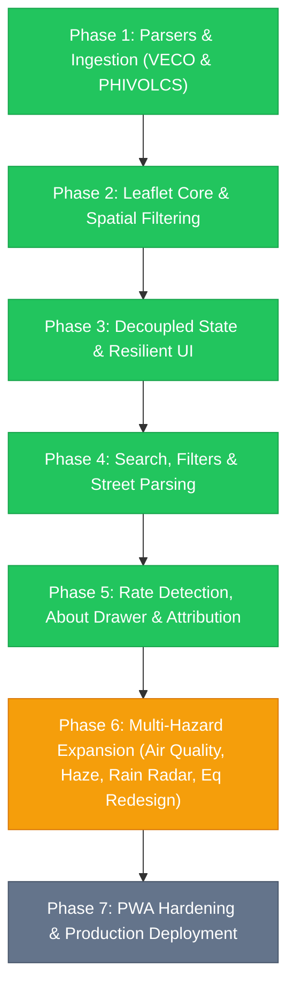

# Watch Cebu — Development & Deployment Roadmap (Corrected)

*Supersedes the previous `implementation_plan.md`. Two factual errors fixed: the watch radius was misstated (doc said 100km; the actual, unchanged code is 300km, per the original Stage 1 decision to cover all of Visayas), and the air-quality crisis was framed as ongoing when it had already resolved roughly two weeks prior. No phase status or code claims changed beyond these two corrections — everything else in the original roadmap was checked against the actual repository and held up.*

## Master Phase Status Overview

| Phase | Description | Status | Exit Artifacts |
| :--- | :--- | :--- | :--- |
| **Phase 1** | **Verified Scrapers & Fixtures** (VECO HTML & PHIVOLCS) | ✅ **Shipped, independently verified** | `veco.ts`, `phivolcs.ts`, HTML test fixtures |
| **Phase 2** | **Core Spatial Engine & Base Map** (Leaflet 1.9.4, CartoDB basemap, **300km Cebu radius filter**) | ✅ **Shipped, independently verified** | `mapController.ts`, `WATCH_RADIUS_KM = 300` in `src/utils/index.ts` |
| **Phase 3** | **Decoupled Data Architecture & Freshness Chips** (Independent feeds, offline cache) | ✅ **Shipped, independently verified** | `dataFeed.ts`, `header.ts` |
| **Phase 4** | **Filter Ergonomics, Street Name Extraction & UX Pass 1** | ✅ **Shipped, independently verified** | `extractStreets` bugfix, `ux-review-log.md` |
| **Phase 5** | **Rate Parser, NGCP Grid Sourcing Gate & About Drawer** | ✅ **Shipped, independently verified** | `vecoRates.ts` (5 real fixtures), NGCP explicitly deferred with documented reasoning (`Data-Standards.md` §11.6), `about.ts` |
| **Phase 6** | **Multi-Hazard Expansion & Marker Redesign** | ✅ **Shipped, independently verified** | Open-Meteo Air Quality, Option C Earthquake Pin, Today's Weather Forecast Button & Top Dropdown Drawer (replaces RainViewer radar / Himawari-9 satellite) |
| **Phase 7** | **PWA Hardening & Cloud Deployment** | ⏳ **Upcoming** | Vite PWA service worker, Cloudflare/Vercel deploy |

**Correction note on Phase 2:** the watch radius is **300km** from Cebu City, not 100km. This has been the case since the original Stage 1 discovery decision and was never changed — the 100km figure in the previous roadmap draft was a documentation error, not a code change. The 300km radius is what deliberately captures all of Visayas, not just the immediate Cebu area.

---

## Phase 6 Detailed Plan: Multi-Hazard Expansion & Option C Pin

### Context — corrected framing

Metro Cebu experienced a significant transboundary haze event in **early September 2026**: AQI readings reached the "acutely unhealthy" range (as high as ~296 in parts of the region), driven by wildfire smoke originating in Kalimantan and Sumatra, Indonesia, carried across by habagat (southwest monsoon) winds. This genuinely triggered face-to-face class suspensions across Cebu City, Talisay, Lapu-Lapu, Carcar, and Minglanilla between roughly September 1–7, 2026. Air quality was reported as improving by September 7.

**This event has already resolved as of today.** Phase 6 exists because haze events of this kind are recurring (driven by seasonal habagat winds and regional fire activity, not a one-off), and Watch Cebu should be ready to surface this kind of hazard the next time it happens — not because it is happening right now. Any UI copy, advisory drawer text, or launch messaging for this feature should be written in that recurring-preparedness framing, not as if describing a live, ongoing emergency.

### Sprint Deliverables

#### 1. Air Quality & Transboundary Smoke Haze Monitoring
- **Source:** Open-Meteo Air Quality API (`https://air-quality-api.open-meteo.com/v1/air-quality?latitude=10.3157&longitude=123.8854&current=pm10,pm2_5,carbon_monoxide,aerosol_optical_depth,us_aqi,european_aqi`) — free, no API key required.
- **Header AQI chip:** standard color-coded bands (0–50 Good/Green through 301+ Emergency/Maroon).
- **Haze Advisory Drawer:** explains smoke origin and habagat transport mechanism in general, recurring-hazard terms; outlines DOH/DENR-EMB guidance (N95/KN95 masks, staying indoors); references the September 2026 event as a documented past example, not a live status claim, unless the live AQI reading itself currently warrants that framing.

#### 2. Today's Weather Forecast Button & Dropdown Drawer (Phase 6 Correction)
- **Problem with Prior Tile Layers:**
  - RainViewer Doppler radar tiles render 100% transparent when it is not actively raining, making the layer look broken or empty to users.
  - Himawari-9 satellite tiles are capped at Level 6 native zoom, causing blurry, pixelated maps when zoomed to Cebu City (zoom 10+).
- **Solution:** Replaced radar and satellite map layers with a clean, lightweight "Forecast" button in the header and a top slide-down Forecast Drawer (`#forecast-drawer`).
- **Source:** Open-Meteo Weather Forecast API (`latitude=10.3157&longitude=123.8854&hourly=precipitation_probability,precipitation,cloud_cover,wind_speed_10m,weather_code&timezone=Asia%2FManila&forecast_days=1`).
- **UX Design:** Strictly limited to `forecast_days=1` (24 hours). Features a horizontal-scrolling flex row (`.forecast-hours-scroll`) of compact cards highlighting Time, Weather Icon, Rain Probability %, and Wind Speed (km/h), with the current hour highlighted ("NOW" badge).

#### 3. Earthquake Alert Marker Redesign (Option C)
- Magnitude circle + curved annular location-name wedge; selective GPU-accelerated pulse for <24h or M4.0+ events; raw SVG in `L.divIcon`, no new dependency.

#### 4. Date/Time Humanization
- Complete `formatPhilippineDateTime` with full test coverage.

---

## Phase 7: Deployment & Production Plan — unchanged

1. PWA manifest + offline service worker, standalone display mode, custom icons.
2. Production build verification (`npm run build`), bundle size check (<150KB gzipped target).
3. Deploy to Cloudflare Pages or Vercel with HTTPS, edge CDN, GitHub CI/CD.

---

## Verification Plan for Phase 6 — unchanged

### Automated Tests
- Open-Meteo air quality parsing, AQI categorization, offline fallback handling
- Option C earthquake marker SVG generation
- Full `npm test` suite

### Manual Acceptance Testing
1. Live AQI badge renders with correct color/number
2. Advisory drawer shows haze context in recurring-hazard framing, not live-crisis framing, unless the current live reading genuinely warrants it
3. Rain radar toggle renders cleanly
4. Earthquake markers match the Option C sketch; pulse behavior correct for recent/strong events
